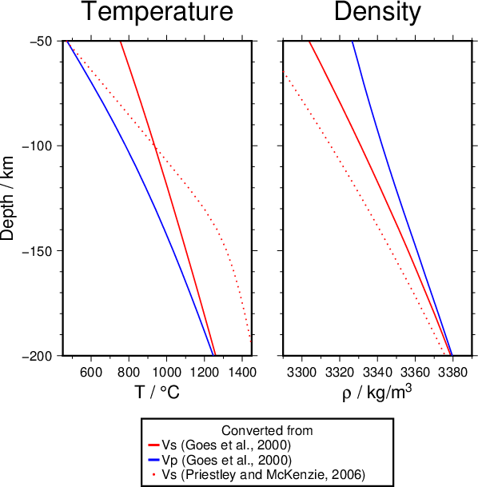

# VeloDT

[](https://zenodo.org/badge/latestdoi/121383426)
[](https://travis-ci.org/cmeessen/VeloDT)

*VeloDT* contains two C++ implementations of *Vp*- and/or *Vs*-conversions to temperature and/or density valid in the upper mantle.

<p align="center">
<br>
Vp and Vs converted from PREM (Dziewonski and Anderson, 1981) using the two
different approaches.
</p>

## Getting started

Either clone the github repository with

```bash
git clone https://github.com/cmeessen/VeloDT.git
```

or download the [latest release](https://github.com/cmeessen/VeloDT/releases/latest) as source code or binary and extract it somewhere. If you downloaded the source code, you will have to compile the code (see below).

- [**V2RhoT**](./V2RhoT.md) closely follows [Goes et al. (2000)](https://doi.org/10.1029/1999JB900300) to convert vp or
vs to temperature and density assuming a mineral assemblage
- [**V2T**](./V2T.md) implements the method by [Priestley and McKenzie
(2006)](https://doi.org/10.1016/j.epsl.2006.01.008) and converts *Vs* to temperature
- [**T2Rho**](./T2Rho.md) applies the equations of [Goes et al. (2000)](https://doi.org/10.1029/1999JB900300) to compute densities from a given mineral composition, temperature and pressure

Please refer to the original publications for validity and pitfalls of the methods.

A Python implementation of *V2RhoT*, optimized for regularly gridded data, is available [here](https://github.com/cmeessen/VelocityConversion).

### Requirements

The requirements for compilation and running the code are

- [Qt4](https://www.qt.io/download) or later and qmake
- a C++ compiler, e.g. GCC

Requirements for plotting the example:

- [GMT](http://gmt.soest.hawaii.edu/)
- make

### Compiling

Navigate to the base folder `./VeloDT` and execute

```bash
qmake
make
```

This will build the `V2RhoT` and `V2T` executables and put them in the `./VeloDT` folder.

## License

VeloDT is published under the terms of [**GNU General Public License v3.0**](./LICENSE).

## Bibliography

- Cammarano, Fabio, Saskia Goes, Pierre Vacher, and Domenico Giardini. “Inferring Upper-Mantle Temperatures from Seismic Velocities.” Physics of the Earth and Planetary Interiors 138, no. 3–4 (August 2003): 197–222. https://doi.org/10.1016/S0031-9201(03)00156-0.

- Dziewonski, Adam M., and Don L. Anderson. “Preliminary Reference Earth Model.” Physics of the Earth and Planetary Interiors 25, no. 4 (June 1, 1981): 297–356. https://doi.org/10.1016/0031-9201(81)90046-7.

- Goes, S., R. Govers, and P. Vacher. “Shallow Mantle Temperatures under Europe from P and S Wave Tomography.” Journal of Geophysical Research: Solid Earth 105, no. B5 (2000): 11153–69. https://doi.org/10.1029/1999JB900300.

- Kennett, B. L. N., E. R. Engdahl, and R. Buland. “Constraints on Seismic Velocities in the Earth from Traveltimes.” Geophysical Journal International 122, no. 1 (July 1, 1995): 108–24. https://doi.org/10.1111/j.1365-246X.1995.tb03540.x.

- Priestley, Keith, and Dan McKenzie. “The Thermal Structure of the Lithosphere from Shear Wave Velocities.” Earth and Planetary Science Letters 244, no. 1–2 (April 15, 2006): 285–301. https://doi.org/10.1016/j.epsl.2006.01.008.

- Saxena, Surendra K., and Guoyin Shen. “Assessed Data on Heat Capacity, Thermal Expansion, and Compressibility for Some Oxides and Silicates.” Journal of Geophysical Research: Solid Earth 97, no. B13 (Dezember 1992): 19813–25. https://doi.org/10.1029/92JB01555.
