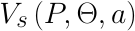
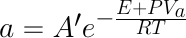
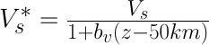
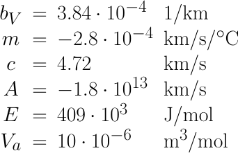
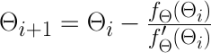
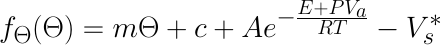
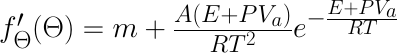

# V2T

This piece of code is a C++ implementation of the approach described by [Priestley and McKenzie (2006)](https://doi.org/10.1016/j.epsl.2006.01.008). The authors establish an empirical relationship between shear wave velocity and temperature from a thermal model of the Pacific lithosphere, P/T estimates from mantle nodules and 3D tomographic shear wave velocity models. Please refer to the original publication for more details. In this section we will have a look at the equations implemented in the code.

## Compilation

Before compilation make sure to have Qt and qmake installed. Then go to this folder and run

```
qmake
make
```

This generates the `V2T` executable.

## Using V2T

Executing `V2T -h` displays the available console commands together with two examples.

```
usage: V2T File_In File_Out [options]

  Required input parameters:
  --------------------------
  File_In          Path and name of grid file containing x y z Vs
  File_Out         Output file name and path

  Option    Value Default Description
  ------    ----- ------- -----------
  -h                      This information
  --help                  Extended information
  -ERM      string  AK135 P calculation method AK135, PREM or simple
  -outVs                  Writes VsObs and VsCalc to output file
  -rc       val      2890 Crustal density in kg/m3
  -rm       val      3300 Mantle density in kg/m3
  -ra       val      3100 Average density in kg/m3 used in '-ERM simple'
  -scaleZ   val         1 Scale every z-value by this value
  -scaleVs  val         1 Scale every Vs-value by this value
  -t_crust  path          EarthVision file for crustal thickness
  -z_topo   path          EarthVision file for topogrpahy
  -t        val       0.1 Threshold for Newton iterations
  -scatter                Use scattered data as input
  -v                      For debugging
```

More extensive help is shown using the `--help` flag:

```
*****************************************************************
Calculates Temperature from s-wave velocities following approach
by Priestley and McKenzie (2006): "The thermal structure of the
lithosphere from shear wave velocities"
*****************************************************************
Source: https://github.com/cmeessen/MantleConversions

The pressure for each point is calculated in 1D, regarding
the topographic elevation 'File_z_topo', a crust with a
homogeneous density 'rho_crust' and thickness defined by
'File_t_crust', as well as a homogeneous mantle with density
'rho_mantle'.

Requirements
  - all input grids must have the same spacing and X / Y
    dimensions (this is checked prior to calculation)
  - Homogeneous s-wave velocity grid
  - topographic elevation grid
  - crustal thickness grid

Information on input data
-------------------------
  1) S-Waves
     a) Homogeneous 3D s-wave velocity grid
        Data fromat: GMS Grid Points
        Columns:
        0 - X  [m]
        1 - Y  [m]
        2 - Z  [m]      values < MSL must be negative
        3 - Vs [km/s]
     b) Scattered input data
        Same column format as a) but scattered

  2) Topographic elevation grid
        Data format: EarthVision Grid
        Columns:
        0 - X [m]
        1 - Y [m]
        2 - Z [m]

  3) Crustal thickness grid
     Data format: EarthVision Grid
        0 - X [m]
        1 - Y [m]
        2 - t [m]

Information on pressure calculation
-----------------------------------
If nothing is specified the pressure is calculated using the
AK135 Earth reference model (Kennet et al., 1995). Specifying
'-ERM model' allows to calculate pressure with PREM
(Dziewonski and Anderson, 1981). Both models are implemented for
depths up to 660 km. The model 'simple' uses the average
density specified with '-ra'.

Debug information
-----------------
Use './V2T 0 0 --WRITE_P model' to print calculated
pressures for the specific model. [model] can be 'AK135',
'PREM' or 'simple'.
```

### Mandatory arguments

`V2T` requires the input file `File_In`, containing x y z and vs, and the name of the output file `File_Out`. Input units for z is masl, for vs km/s.

### Pressure calculation

Standard calculation of **pressure** uses the earth reference model AK135.
- options are `AK135`, `PREM` or `simple`
- `-ERM PREM` activates pressure calculation with PREM
- `-ERM simple` uses the average density defined with `-ra`
- an experimental feature is the pressure calculation using topography and crustal thickness. This is activated by using `-t_crust FILENAME` and `-z_topo FILENAME`, which both require EarthVision formatted grids containing crustal thickness and topographic elevation. The pressure is then calculated assuming constant density for the crust (`-rc 2890`) and mantle (`-rm 3300`)
- `-ra` defines an average density which is then used to calculate the pressure

<!--  -->
## Theory

For low amounts of melt, shear wave velocity depends on temperature, pressure and an activation process

<p align="center"></p>

where _P_ is pressure, _Theta_ is the temperature in °C and _a_ describes the activation process which is responsible for the decrease of Vs at temperatures close to the melting point

<p align="center"></p>

where _A'_ is a frequency factor, _E_ the activation energy, _Va_ the activation volume, _R_ the universal gas constant and _T_ the temperature in Kelvin.

For convenience, the authors removed the nonactivated part of the pressure dependency of _Vs_

<p align="center"></p>

with _z_ as depth in km and _bv_ as an empirical constant that was derived in the original publication. The authors assumed that variations in shear wave velocity in the upper mantle is small and expanded Vs*(a) in a Taylor series, obtaining

<p align="center"></p>


They determined the empirical constants as

<p align="center"></p>

Based on the corrected shear wave velocity _Vs*_ the temperature Theta for point _n_ was calculated as follows

<p align="center"></p>

If _Vs*_ is below 4.4km/s, the temperature is iteratively calculated using the Newton-Raphton iteration

<p align="center"></p>

where _i_ represents the iteration step. We define the function _fTheta_ (```double V2T::ftheta(double VsS, double P, double T)```) as

<p align="center"></p>

Accordingly the derivative is (```V2T::dfdtheta(double P, double T)```)

<p align="center"></p>

## Resources

Priestley, Keith, and Dan McKenzie. “The Thermal Structure of the Lithosphere from Shear Wave Velocities.” Earth and Planetary Science Letters 244, no. 1–2 (April 15, 2006): 285–301. https://doi.org/10.1016/j.epsl.2006.01.008.
